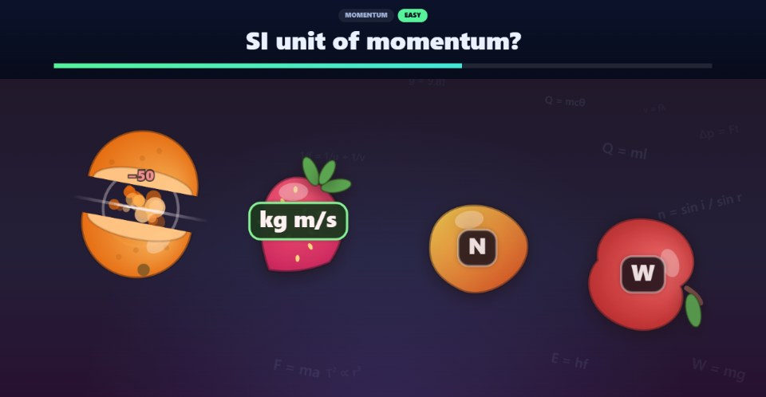

<div align="center">

# 🍉 Physics Fruit Rush

**A fast arcade recall game for Malaysian KSSM Form 4 Physics — in English and Bahasa Melayu.**

Read the question. Find the answer. Slice the fruit.
*Baca soalan. Cari jawapan. Tebas buahnya.*

[](LICENSE)
[](#no-build-step)
[](#no-build-step)
[](#question-bank)
[](#two-languages-one-game)
[](CHANGELOG.md)



</div>

---

```
SHORT QUESTION  →  THINK FAST  →  SLICE THE ANSWER  →  INSTANT FEEDBACK  →  NEXT
```

*Above: a wrong answer has just been sliced (− 50), and the correct one is
revealed in green. In Practice Mode the game also names the misconception behind
the option you picked.*

It is deliberately **not** a quiz with radio buttons. It is a reaction game that
happens to drill Physics — built so that a student who only meant to play for two
minutes ends up revising for ten.

---

## Quick start

**Download the repo and double-click `index.html`.** That is the whole
installation.

No server, no build step, no npm install, no login, no database, no internet
connection after the first load.

If a school-managed browser blocks `file://`, serve the folder with anything:

```bash
python -m http.server 8000
```

**For a Bahasa Melayu class**, open or share the game with `?lang=bm` on the end —
`index.html?lang=bm`, or `https://<you>.github.io/<repo>/?lang=bm` once it is online.
The link sets the language and remembers it; students can still switch at any time.

### Play it online

1. Push this repository to GitHub.
2. **Settings → Pages → Build and deployment → Source: `GitHub Actions`.**
3. Push to `main`.

The included workflow checks every question and every translation, then publishes
the game. The repository *is* the site — there is nothing to build. Your URL will be
`https://<your-username>.github.io/<repo-name>/`.

---

## Two languages, one game

Every screen, all **385 questions**, every explanation and all **154 misconception
notes** are available in **English** and **Bahasa Melayu**, written with KSSM Form 4
textbook terms and DBP spelling — *sesaran, halaju, pecutan, muatan haba tentu,
pembelauan, pantulan dalam penuh, kanta cembung*.

* **A switch at the top of the menu** — *English | Bahasa Melayu*, each written in
  its own language, so a student who cannot read the current one can still find
  theirs. No flags: a flag names a country, not a language.
* **Remembered**, and kept even when a student resets their progress.
* **English by default.** The browser's language is deliberately ignored: on a shared
  classroom machine it describes whoever set the machine up, not the student.
* **Never mid-round.** A round keeps the language it started in — answer labels are
  laid out when the fruit launch.
* **Progress is shared.** Switching language keeps every bit of mastery and every best
  score. Knowing Physics does not reset because the labels changed.
* **Browser translation is switched off** (`translate="no"`). The game ships its own
  BM; a machine would re-translate correct terms — *Air* (water) becomes *Udara*.

**Learning in both languages.** SPM Physics papers print every question in BM *and*
English, and students from BM-medium and English-medium (DLP) classes sit the same
paper. So in Practice Mode the feedback card also shows the answer in the language
that is not on screen:

```
✗ BELUM TEPAT
Jawapan: Sesaran
“Jarak” — Jarak hanya ada magnitud - sesaran ada arah.
INGAT · Sesaran mempunyai magnitud DAN arah.
DALAM BI · Displacement
```

**Fair in both languages.** Longer text earns more reading time, so this was measured
over the whole bank: the average reaction window is 6.64 s in English and 6.67 s in
BM, and in neither language is the correct answer given away by being the longest
option (28 % and 24 % of questions, against 25 % by chance).

---

## What makes it different

Most classroom quiz games are a quiz with decoration bolted on. The design rules
here are the opposite way round:

**"Harder" must never mean "unreadable."**
Every fruit is launched on a real ballistic arc, but gravity is not guessed — it
is solved from the two things that actually matter, the airtime `T` (how long the
student is allowed to think) and the apex height `A`:

```
g = 8A / T²          v₀ = gT / 2
```

So a fruit can never be flung off the top of the screen and never leaves before
the thinking time is up. Speed presets change `T`, which means *faster* always
means *less time to think*, never *harder to read*. The reaction window itself is
derived from the question's difficulty, the speed preset, the session stage and
**how much text there is to read** — long questions and formula answers
automatically earn more time.

**An effect may never obscure an answer.**
There is real arcade juice — a 55 ms freeze-frame on impact, a cut-line flash
along the blade path, directional juice, sparks, combo-scaled screen shake — but
debris draws *behind* live fruit, the flash is short, and shake is hard-capped.
The question stays the loudest thing on screen.

**Mistakes have to teach.**
Slice the wrong fruit and the game names the *specific* misconception rather than
just showing the right answer:

> ✗ **NOT QUITE** — Answer: newton
> *"joule" — Joule is the unit of energy.*
> Force is derived: 1 N = 1 kg m s⁻².

**The game learns what you are bad at.**
Every topic carries a mastery value that moves with each answer and persists
between sessions. Weak topics come up more often. Measured over 400 simulated
sessions: a topic you keep failing appears **×1.52** its fair share while a
mastered one drops to **×0.42** — with no repeats inside a session.

---

## Progress, practice and reset

**A progress panel on the menu** — one mastery bar and three numbers (Answered,
Strongest, Practise next), not a dashboard.

**Weak-topic practice in one tap.** `PRACTISE WEAK TOPICS` drops straight into
Practice mode on the topic the model rates weakest. The results screen repeats the
idea with a concrete reason — *"Practise Refraction of Light — 3 mistakes this
round"* — above a button that starts exactly that.

**Personal bests where you choose a mode**, shown on the mode buttons themselves.

**Reset Progress, done safely.** A quiet link under the progress panel opens a
confirmation dialog. Focus starts on **CANCEL**, `Escape` cancels, and cancelling
changes nothing at all.

### What Reset Progress clears

`js/storage.js` is the single owner of persistence, and **`localStorage.clear()` is
never called** — CI fails the build if it ever appears. Reset removes only
*progress* keys under `physics-fruit-rush.v4.`; *settings* survive:

| Key | Holds | On reset |
|---|---|---|
| `…v4.mastery` | per-topic mastery | cleared |
| `…v4.best.<mode>` | best score per mode | cleared |
| `…v4.settings.lang` | language | kept |
| `…v4.settings.sound` | sound on / off | kept |
| `…v4.settings.mix` | adaptive / balanced question mix | kept |

It never touches any other site's data — which matters on a shared school machine —
and writes no cookies, no IndexedDB and no files.

---

## Game modes

Each mode has its own source of pressure, so none of them is a re-skin of
another.

| Mode · *BM* | Pressure | Lives | The hook |
|---|---|---|---|
| **Quick Game** · *Main Cepat* | fixed 60 s clock | 5 | The straightforward round. |
| **Time Rush** · *Kejar Masa* | the clock *is* the score | none | Starts at 30, 40 or 60 s. Every correct answer buys **+2.5 s**; a wrong one costs 3 s. |
| **Survival** · *Bertahan* | lives only | 3 | Being too slow costs a life — here and nowhere else. Ramps fastest. |
| **Topic Challenge** · *Cabaran Topik* | fixed set, one topic | 5 | 20 questions, then a mastery report. |
| **Practice** · *Latihan* | none | ∞ | Explanations, misconception notes, the answer in both languages, and wrong answers come back. |

Four speed presets — **Relaxed / Normal / Fast / Extreme** (*Santai / Biasa /
Pantas / Ekstrem*) — control the playfield, not the physics content.

---

## Controls

| Input | How |
|---|---|
| Mouse | Drag through the fruit |
| Touch / stylus | Swipe through the fruit |
| Tap | A straight tap counts as a slice |
| Keyboard | <kbd>1</kbd> <kbd>2</kbd> <kbd>3</kbd> <kbd>4</kbd> slice left to right |
| Pause | <kbd>Esc</kbd> |

A wild swipe across the whole screen commits to **one** answer — the one the blade
reaches first. On a shared classroom panel a second finger cannot cancel the first
student's swipe, and a gesture the browser cancels is never scored.

---

## Question bank

**385 questions** covering all 28 KSSM Form 4 Physics topics, in 12 groups, each in
English and Bahasa Melayu.

| | |
|---|---|
| Difficulty split | 152 easy · 161 medium · 72 hard |
| With misconception notes | 154 (40 %), all translated |
| Bahasa Melayu | 385 / 385 complete |
| Validator problems | 0 |

Distractors are built from real Form 4 mistakes — unit confusion, inverted
formulae, inverse-square slips, sign errors, `373 °C` for the boiling point of
water, convex ↔ concave reversal.

### Adding a question

One English row, in the relevant file under `data/`:

```js
['m', 'SI unit of momentum?', ['kg m/s', 'N', 'J', 'W'], 'p = mv → kg × m/s.',
 { 'N': 'Newton is force.', 'J': 'Joule is energy.' }]
//  ↑ difficulty            ↑ FIRST ANSWER IS CORRECT    ↑ explanation  ↑ optional notes
```

…and its Bahasa Melayu row in the matching file under `data/ms/`, keyed by the
English question text, with the answers **in the same order**:

```js
'SI unit of momentum?': ['Unit SI bagi momentum?', ['kg m/s', 'N', 'J', 'W'],
                         'p = mv memberikan kg × m/s.', { 'N': 'Newton ialah daya.' }],
```

See **[CONTRIBUTING.md](CONTRIBUTING.md)** for the full guide. Then check it:

```bash
node tools/validate.js
```

— or, with no Node at all, open **`tools/qa.html`** in a browser. Both check the
English, every translation (same numbers, same formulae, same misconception notes,
nothing left untranslated), the interface text, and that every answer label fits
its fruit on a phone.

---

## Project structure

```
├── index.html              screens and markup; every visible word has a data-i18n key
├── style.css               arcade theme, responsive layout
├── lang/
│   ├── en.js               every interface string, English
│   └── ms.js               every interface string, Bahasa Melayu
├── data/
│   ├── question-bank.js    format, builder, validators, view(question, language)
│   ├── questions-mechanics.js     topics 1–10   (English source)
│   ├── questions-heat-waves.js    topics 11–19
│   ├── questions-light.js         topics 20–28
│   └── ms/*.ms.js          the Bahasa Melayu overlay, one file per chapter
├── js/
│   ├── config.js           EVERY tunable number lives here - and no display text
│   ├── storage.js          the only owner of localStorage (settings vs progress)
│   ├── i18n.js             the only file that knows which language is on screen
│   ├── audio.js            synthesised sound — no audio files
│   ├── fruits.js           procedural fruit artwork and answer labels
│   ├── effects.js          juice, screen shake, popups, freeze-frame
│   ├── engine.js           flight physics, slicing, rendering
│   ├── learner.js          adaptive revision model
│   ├── game.js             modes, scoring, lives, stages, end report
│   ├── ui.js               screens, HUD, feedback, results, dialog
│   └── main.js             bootstrap, input, main loop
└── tools/
    ├── validate.js         headless content checks (used by CI)
    └── qa.html             the same checks and a label-fit audit, in a browser
```

Concerns are kept apart: `engine.js` knows nothing about scoring, `game.js`
touches no DOM, `ui.js` is the only file that queries elements, `storage.js` is
the only file that touches `localStorage`, and `i18n.js` is the only file that
knows the language — there is no `if (language === ...)` anywhere else.

**Want to re-tune the game?** Open `js/config.js`. Sentences that quote a rule
("60 seconds · 5 lives", "Lose 50 points") read their numbers from it, so the help
text can never describe an old rule.

### No build step

Vanilla HTML, CSS and JavaScript. No framework, no bundler, no package.json, no
dependencies. Every sound is synthesised in the browser with the Web Audio API
and all eleven fruit types are drawn procedurally on a canvas — there are no
image or audio assets to download, which is also why the whole game, in both
languages, is under 500 KB and works offline.

---

## Classroom notes

* Runs on desktop, laptop, tablet, phone and interactive classroom displays.
* No accounts and no data leaves the device. If storage is blocked (private window,
  locked-down school browser) the game still plays — it just forgets.
* Share `?lang=bm` with a BM class; students can still switch on the menu.
* For a whole-class round, set **Question Mix → Balanced** in the setup screen so
  the projected questions are not tuned to one device's history.
* Every control is at least 44 px tall and has a visible focus ring; feedback never
  relies on colour alone; screen readers are told when the language changes.

---

## Known limitations

* **The Bahasa Melayu text should be reviewed by a BM-medium Physics teacher**
  before wide use. It follows KSSM terminology and passes every automated check, but
  no check can judge whether a sentence reads naturally to a Form 4 student.
  Everything to review is in `data/ms/` and `lang/ms.js`, with the English beside it.
* **Portrait phones are cramped.** Everything fits, but some long words still break
  (at syllable boundaries) on a 375 px screen. Landscape is better.
* **Progress is per-browser, per-device.** No accounts, no sync, no class view.
* Audio needs one user interaction before it can start — a browser rule.
* Tested in Chromium. Not yet verified on real touch hardware, Firefox or Safari.

See [CHANGELOG.md](CHANGELOG.md) for the full version history and the bugs fixed
along the way.

---

## Contributing

Most contributions are questions or translations, not code — and you do not need to
know JavaScript for either. Start with **[CONTRIBUTING.md](CONTRIBUTING.md)**.

## Licence

[MIT](LICENSE). The copyright line currently reads *"Physics Fruit Rush
contributors"* — put your own name there if you would rather.

Fruit artwork, sound, questions and translations are all original to this project.
